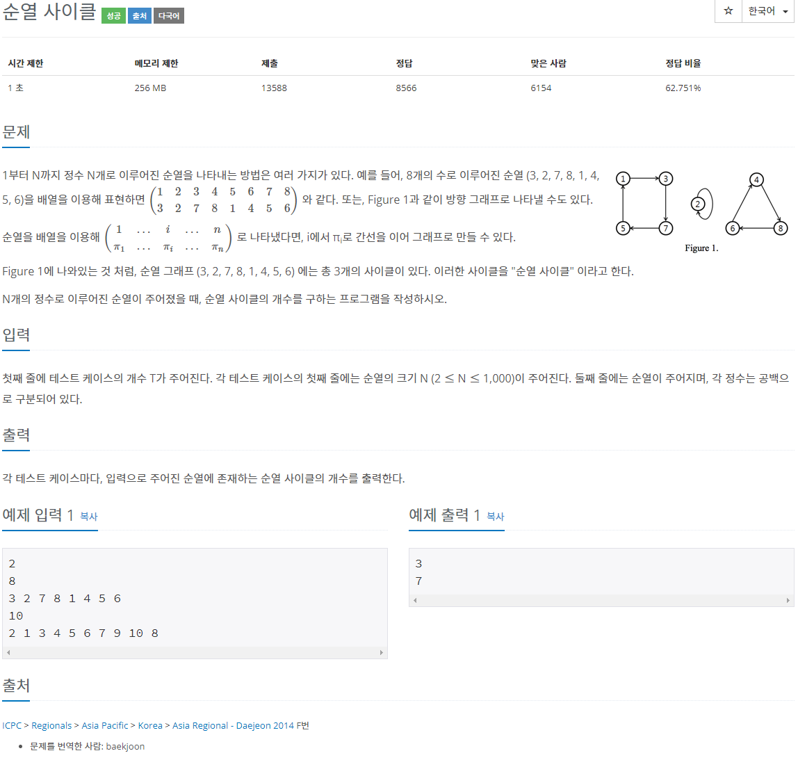
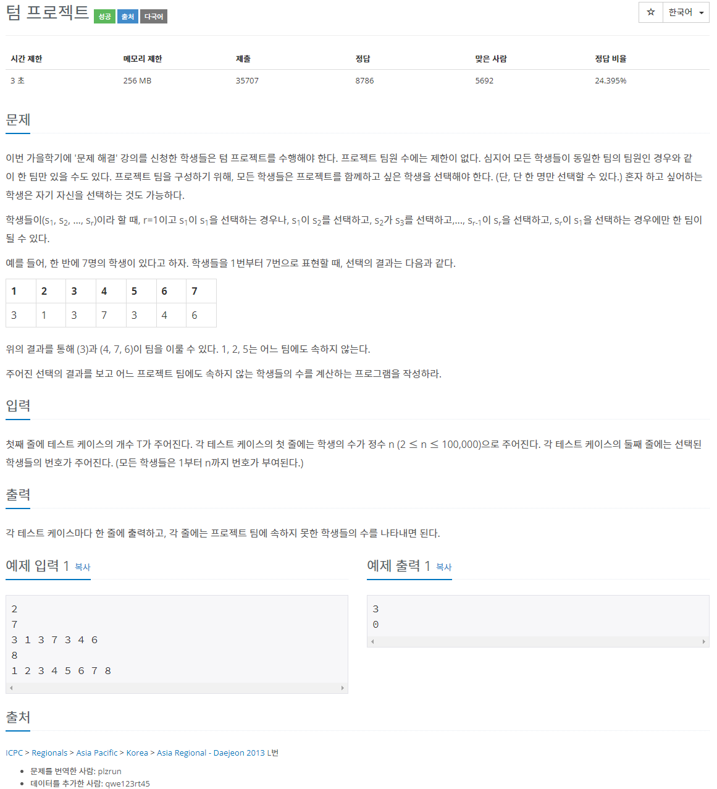
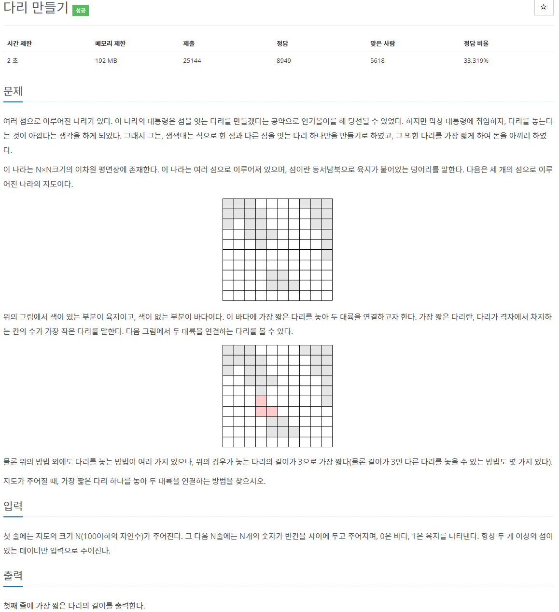
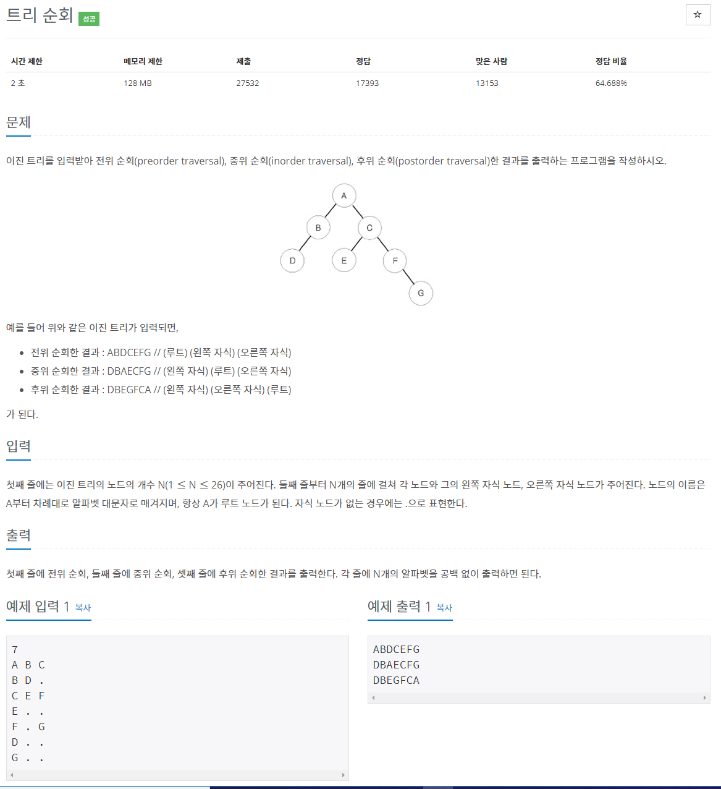
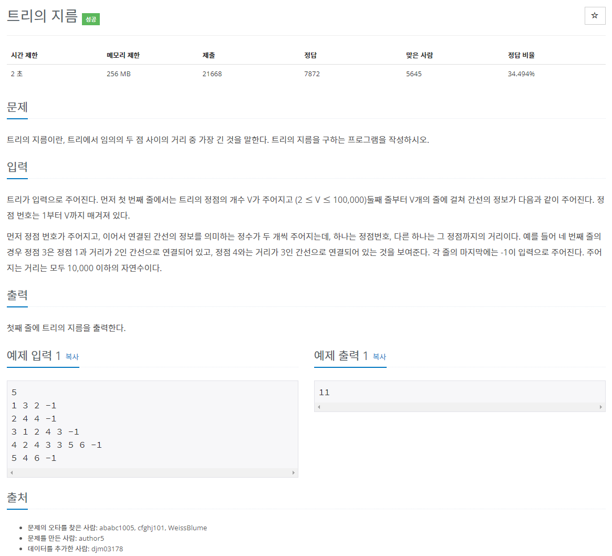

[문제집 출처](https://plzrun.tistory.com/entry/%EC%95%8C%EA%B3%A0%EB%A6%AC%EC%A6%98-%EB%AC%B8%EC%A0%9C%ED%92%80%EC%9D%B4PS-%EC%8B%9C%EC%9E%91%ED%95%98%EA%B8%B0)

## DFS와 BFS (#1260)

[(링크)](https://www.acmicpc.net/problem/1260)


[풀이]

```cpp
#include<iostream>
#include<vector>
#include<queue>
#include<algorithm>
using namespace std;
class Graph{
    public:
        int N;
        vector<vector<int>> adj;
        vector<bool> visited;

        Graph(): N(0){}
        Graph(int n): N(n){
            adj.resize(N+1);
            visited.resize(N+1);
        }

        void addedge(int u, int v){
            adj[u].push_back(v);
            adj[v].push_back(u);
        }

        void sortlist(){
            for(int i=0; i<=N; i++)
                sort(adj[i].begin(),adj[i].end());
        }

        void initiallize(){
            fill(visited.begin(),visited.end(),false);
        }

        void dfs(int curr){
            visited[curr] = true;
            cout << curr << " ";
            for(int next: adj[curr]){
                if(visited[next] == false)
                    dfs(next);
            }
        }

        void bfs(int start){
            queue<int> Q;
            Q.push(start);
            visited[start]=true;
            while(!Q.empty()){
                int curr = Q.front();
                Q.pop();
                cout << curr << " ";
                for(int next: adj[curr]){
                    if(visited[next] == false){
                        visited[next] = true;
                        Q.push(next);
                    }
                }
            }
        }


};

int main(){
    int n,m,v;
    cin >> n >> m >> v;
    Graph G(n);
    while(m--){
        int a,b;
        cin >> a >> b;
        G.addedge(a,b);
    }
    G.sortlist();
    G.initiallize();
    G.dfs(v);
    G.initiallize();
    cout << '\n';
    G.bfs(v);
}

```

## 연결 요소의 개수 (#11724)

[(링크)](https://www.acmicpc.net/problem/11724)


[풀이]

```cpp
#include<iostream>
#include<algorithm>
#include<vector>
using namespace std;
class Graph{
    public:
        int N;
        vector<vector<int>> adj;
        vector<int> visited;

        Graph():N(0){}
        Graph(int n):N(n){
            adj.resize(n+1);
            visited.resize(n+1);
        }

        void addedge(int u, int v){
            adj[u].push_back(v);
            adj[v].push_back(u);
        }

        void sortlist(){
            for (int i=0; i<= N; i++){
                sort(adj[i].begin(),adj[i].end());
            }
        }

        void initiallize(){
            fill(visited.begin(),visited.end(),false);
        }

        void dfs(int curr){
            visited[curr]=true;
            for( int next :adj[curr]){
                if( visited[next] == false)
                    dfs(next);
            }
        }
};

int main(){
    int n, m;
    cin >> n >> m;
    Graph G(n);
    while(m--){
        int a, b;
        cin >> a >> b;
        G.addedge(a,b);
    }
    G.sortlist();
    G.initiallize();
    int cnt=0;
    for(int i=1; i<=n; i++){
        if(G.visited[i] == false){
            G.dfs(i);
            cnt++;
        }
    }
    cout << cnt;
}
```

## 이분 그래프 (#1707)

[(링크)](https://www.acmicpc.net/problem/1707)


[풀이]

```cpp
#include<iostream>
#include<vector>
#include<queue>
#include<algorithm>
using namespace std;
class Graph{
    public:
        int N;
        vector<vector<int>> adj;
        vector<bool> visited;
        vector<bool> color; // bfs를 진행하며 순서대로 true/ false 를 각각 지정함
        bool is_bipartitegraph=true; //최종적으로 이분그래프의 여부를 저장

        Graph(): N(0){}
        Graph(int n): N(n){
            adj.resize(N+1);
            visited.resize(N+1);
            color.resize(N+1);
        }

        void addedge(int u, int v){
            adj[u].push_back(v);
            adj[v].push_back(u);
        }

        void sortlist(){
            for(int i=0; i<=N; i++)
                sort(adj[i].begin(),adj[i].end());
        }

        void initiallize(){
            fill(visited.begin(),visited.end(),false);
        }

        void bfs(int start){
            queue<int> Q;
            Q.push(start);
            visited[start]=true;
            color[start]=true;
            while(!Q.empty()){
                int curr = Q.front();
                Q.pop();
                for(int next: adj[curr]){
                    if(visited[next] == false){
                        visited[next] = true;
                        Q.push(next);
                        color[next]=!color[curr]; //인접한 두 점은 다른 color 로 저장
                    }
                    else{
                        if(color[next]==color[curr])
                            is_bipartitegraph=false; //인접한 두 점이 같은 color일 경우 이분그래프가 아님
                    }
                }
            }
        }
};

int main(){
    int k,v,e;
    cin >> k;
    while(k--){
        cin >> v >> e;
        Graph G(v);
        while(e--){
            int a,b;
            cin >> a >> b;
            G.addedge(a,b);
        }
        G.sortlist();
        G.initiallize();
        for(int i=1; i<=v; i++){
            if(G.visited[i] == false){
                G.bfs(i);
            }
        }
        if(G.is_bipartitegraph)
            cout << "YES\n";
        else
            cout << "NO\n";
    }
}

```

## 순열 사이클 (#10451)

[(링크)](https://www.acmicpc.net/problem/10451)



[풀이]

```cpp
#include<iostream>
#include<algorithm>
#include<vector>
using namespace std;
class Graph{
    public:
        int N;
        vector<vector<int>> adj;
        vector<int> visited;

        Graph():N(0){}
        Graph(int n):N(n){
            adj.resize(n+1);
            visited.resize(n+1);
        }

        void addedge(int u, int v){
            adj[u].push_back(v);
            adj[v].push_back(u);
        }

        void sortlist(){
            for (int i=0; i<= N; i++){
                sort(adj[i].begin(),adj[i].end());
            }
        }

        void initiallize(){
            fill(visited.begin(),visited.end(),false);
        }

        void dfs(int curr){
            visited[curr]=true;
            for( int next :adj[curr]){
                if( visited[next] == false)
                    dfs(next);
            }
        }
};

int main(){
    int t;
    cin >> t;
    while(t--){
        int n;
        cin >> n;
        Graph G(n);
        for(int i=1; i<=n; i++){
            int a;
            cin >> a;
            G.addedge(i,a);
        }
        G.sortlist();
        G.initiallize();
        int cnt=0;
        for(int i=1; i<=n; i++){
            if(G.visited[i] == false){
                G.dfs(i);
                cnt++;
            }
        }
        cout << cnt <<"\n";
    }
}
```

## 반복수열 (#2331)

[(링크)](https://www.acmicpc.net/problem/2331)


[풀이]

```cpp
#include<iostream>
using namespace std;
int v[240000]={0,};

int pow(int a,int p){
    int result=1;
    for(int i=0; i<p; i++)
        result *= a;
    return result;
}

void visit(int a,int p){
    v[a]++;

    if (v[a] ==3)
        return;

    int result=0;
    while(a>0){
        result += pow(a%10,p);
        a/=10;
    }
    visit(result,p);
}

int main(){
    int a,p;
    cin >> a >> p;
    visit(a,p);

    int cnt=0;
    for(int i=0; i<240000; i++){
        if(v[i]==1)
            cnt++;
    }
    cout << cnt;
}
```

## 텀 프로젝트 (#9466)

[(링크)](https://www.acmicpc.net/problem/9466)



[풀이]

```cpp
#include<iostream>
#include<algorithm>
using namespace std;
int n, cnt, g[100001];
bool visited[100001], finished[100001];
// 처음 한 점을 탐색할때 visited= true;
// 그 점에서부터 시작하는 dfs 가 끝났을때 finished = true;

void dfs(int curr){
    visited[curr]=true;
    int next= g[curr];
    if(visited[next] == false)
        dfs(next);
    else if(finished[next] ==false){ // 싸이클 의 조건: 다음 점이 visited 이지만 finished 는 아닐 때!
        for(int temp=next; temp != curr; temp=g[temp])
            cnt++; //싸이클의 점 개수만큼 더함
        cnt++; // 싸이클의 시작점을 빼먹어서 더해줌
    }
    finished[curr]=true;
}

int main(){
    int t;
    cin >> t;
    while(t--){
        cin >> n;
        for(int i=1; i<=n; i++)
            cin >> g[i];

        fill(finished,finished+100001,false);
        fill(visited,visited+100001,false);
        cnt=0;
        for(int i=1; i<=n; i++){
            if(visited[i]==false)
                dfs(i);
        }
        cout << n-cnt << '\n';
    }
}
```

## 단지번호붙이기 (#2667)

[(링크)](https://www.acmicpc.net/problem/2667)


[풀이]

```cpp
#include<iostream>
#include<vector>
#include<string>
#include<algorithm>
using namespace std;
class Graph{
    public:
        int N;
        vector<vector<int>> adj;
        vector<bool> visited;

        Graph(): N(0){}
        Graph(int n): N(n){
            adj.resize(N+1);
            visited.resize(N+1);
        }

        void addedge(int u, int v){
            adj[u].push_back(v);
            adj[v].push_back(u);
        }

        void sortlist(){
            for(int i=0; i<=N; i++)
                sort(adj[i].begin(),adj[i].end());
        }

        void initiallize(){
            fill(visited.begin(),visited.end(),false);
        }

        int dfs(int curr){
            int nodes=1;
            visited[curr] = true;
            for(int next: adj[curr]){
                if(visited[next] == false)
                    nodes += dfs(next);
            }
            return nodes;
        }
};

int main(){
    int n;
    cin >> n;
    int arr[n*n+1];
    for(int i=0; i<n; i++){
        string temp;
        cin >> temp;
        for(int j=1; j<=n; j++){
            arr[n*i+j]=temp[j-1];
        }
    }
    Graph G(n*n);
    for(int i=1; i<=n*(n-1); i++){
        if(i%n !=0){
            if(arr[i]=='1' && arr[i+1]=='1')
            G.addedge(i,i+1);
        }
        if(arr[i]=='1' && arr[i+n]=='1')
            G.addedge(i,i+n);
    }
    for(int i=n*(n-1)+1; i<n*n; i++){
        if(arr[i]=='1'&& arr[i+1]=='1')
            G.addedge(i,i+1);
    }

    G.sortlist();
    G.initiallize();
    vector<int> length;
    int cnt=0;
    for(int i=1; i<=n*n; i++){
        if(G.visited[i]==false && arr[i]=='1'){
            cnt++;
            length.push_back(G.dfs(i));
        }
    }
    sort(length.begin(),length.end());
    cout << cnt << '\n';
    for(int i=0; i<length.size(); i++)
        cout << length[i] << '\n';


}

```

## 섬의 개수 (#4963)

[(링크)](https://www.acmicpc.net/problem/4963)


[풀이]

```cpp
#include<iostream>
#include<vector>
#include<string>
#include<algorithm>
using namespace std;
class Graph{
    public:
        int N;
        vector<vector<int>> adj;
        vector<bool> visited;

        Graph(): N(0){}
        Graph(int n): N(n){
            adj.resize(N+1);
            visited.resize(N+1);
        }

        void addedge(int u, int v){
            adj[u].push_back(v);
            adj[v].push_back(u);
        }

        void sortlist(){
            for(int i=0; i<=N; i++)
                sort(adj[i].begin(),adj[i].end());
        }

        void initiallize(){
            fill(visited.begin(),visited.end(),false);
        }

        void dfs(int curr){
            int nodes=1;
            visited[curr] = true;
            for(int next: adj[curr]){
                if(visited[next] == false)
                    dfs(next);
            }
        }
};

int main(){
    while(true){
        int w, h;
        cin >> w >> h;
        if(w==0 && h==0)
            break;
        int arr[w*h+1];
        for(int i=1; i<=w*h; i++){
            cin >> arr[i];
        }
        Graph G(w*h);
        for(int i=1; i<=w*(h-1); i++){
            if(i%w !=0){
                if(arr[i]==1 && arr[i+1]==1)
                    G.addedge(i,i+1);
                if(arr[i]==1 && arr[i+w+1]==1)
                    G.addedge(i,i+w+1);
            }
            if(i%w !=1)
                if(arr[i]==1 && arr[i+w-1]==1)
                    G.addedge(i,i+w-1);
            if(arr[i]==1 && arr[i+w]==1)
                G.addedge(i,i+w);
        }
        for(int i=w*(h-1)+1; i<w*h; i++){
            if(arr[i]==1&& arr[i+1]==1)
                G.addedge(i,i+1);
        }

        G.sortlist();
        G.initiallize();
        int cnt=0;
        for(int i=1; i<=w*h; i++){
            if(G.visited[i]==false && arr[i]==1){
                cnt++;
                G.dfs(i);
            }
        }
    cout << cnt << '\n';
    }
}
```

## 토마토 (#7576)

[(링크)](https://www.acmicpc.net/problem/7576)


[풀이]

```cpp
#include<iostream>
#include<queue>
using namespace std;
struct point{
    int x, y;
};

int main(){
    int m,n;
    cin >> m >> n;
    int graph[n][m]; // 각 점이 익을때까지 걸리는 시간을 저장
    queue<point> q;
    for(int i=0; i<n; i++){
        for(int j=0; j<m; j++){
            cin >> graph[i][j];
            if(graph[i][j]==1){
                q.push({j,i});
            }
        }
    }
    while(!q.empty()){
        int x =q.front().x;
        int y =q.front().y;
        q.pop();
        struct point around[4]; //주변 4개 점들을 탐색하기 위해 사용
        around[0].x=1;
        around[0].y=0;
        around[1].x=-1;
        around[1].y=0;
        around[2].x=0;
        around[2].y=-1;
        around[3].x=0;
        around[3].y=1;
        for(int i=0; i<4; i++){
            int nx=x+around[i].x;
            int ny=y+around[i].y;

            if(0<=nx && nx <m && 0<=ny && ny <n){ //다음 점이 상자 범위 내에 있는지 확인
                if(graph[ny][nx]==0){
                    graph[ny][nx] =graph[y][x]+1;
                    q.push({nx,ny});
                }
            }
        }
    }
    int result=0;

    for(int i=0; i<n; i++){
        for(int j=0; j<m; j++){
            if(graph[i][j]==0){
                cout << "-1";
                return 0;
            }
            if(result < graph[i][j]){
                result=graph[i][j];
            }
        }
    }
    cout << result-1;
}
```

## 미로 탐색 (#2178)

[(링크)](https://www.acmicpc.net/problem/2178)


[풀이]

```cpp
#include<iostream>
#include<queue>
using namespace std;

struct point{
    int x,y;
};

int main(){
    int n,m;
    cin >> n >> m;
    int searched[n][m];
    for(int i=0; i<n; i++){
        for(int j=0; j<m;j++){
            char temp;
            cin >> temp;
            if(temp=='0')
                searched[i][j]=-1;
            else
                searched[i][j]=0;
        }
    }
    searched[0][0]=1;
    queue <point> q;
    q.push({0,0});
    while(!q.empty()){
        int x =q.front().x;
        int y =q.front().y;
        q.pop();
        struct point around[4]; //주변 4개 점들을 탐색하기 위해 사용
        around[0].x=1;
        around[0].y=0;
        around[1].x=-1;
        around[1].y=0;
        around[2].x=0;
        around[2].y=-1;
        around[3].x=0;
        around[3].y=1;
        for(int i=0; i<4; i++){
            int nx=x+around[i].x;
            int ny=y+around[i].y;

            if(0<=nx && nx <m && 0<=ny && ny <n){ //다음 점이 상자 범위 내에 있는지 확인
                if(searched[ny][nx]==0){
                    searched[ny][nx] =searched[y][x]+1;
                    q.push({nx,ny});
                }
            }
        }
    }

    cout << searched[n-1][m-1];
}
```

## 다리 만들기 (#2146)

[(링크)](https://www.acmicpc.net/problem/2146)



[풀이]

```cpp
#include<iostream>
#include<vector>
#include<queue>
using namespace std;
struct point{
    int x,y;
};

int main(){
    int n;
    cin >> n;
    int map[n][n];
    for(int i=0; i<n; i++){
        for(int j=0; j<n; j++){
            cin>> map[i][j];
        }
    }
    queue<point> q;
    struct point around[4]; //주변 4개 점들을 탐색하기 위해 사용
    around[0].x=1;
    around[0].y=0;
    around[1].x=-1;
    around[1].y=0;
    around[2].x=0;
    around[2].y=-1;
    around[3].x=0;
    around[3].y=1;
    int island=2;
    for(int i=0; i<n; i++){ // bfs 를 통해 같은 섬끼리 번호를 매김!
            for(int j=0; j<n;j++){
                if (map[i][j]==1){ // 여기고쳐야됨!
                    map[i][j]=island;
                    q.push({j,i});
                    while(!q.empty()){
                        int x =q.front().x;
                        int y =q.front().y;
                        q.pop();
                        for(int i=0; i<4; i++){
                            int nx=x+around[i].x;
                            int ny=y+around[i].y;
                            if(0<=nx && nx <n && 0<=ny && ny <n){ //다음 점이 상자 범위 내에 있는지 확인
                                if(map[ny][nx]==1){
                                    map[ny][nx] =island;
                                    q.push({nx,ny});
                                }
                            }
                        }
                    }
                    island++;
                }
            }
    }

    int dist[n][n]={0,};  //k번 섬으로부터의 거리를 저장
    int answer=201;
    for(int k=2; k<island; k++){ //k번 섬에 대한 bfs 탐색
        for(int i=0; i<n; i++){
            for(int j=0; j<n; j++){
                dist[i][j]=-1;
                if(map[i][j]==k){
                    q.push({j,i});
                    dist[i][j]=0;
                }
            }
        }
        while(!q.empty()){
            int x =q.front().x;
            int y =q.front().y;
            q.pop();
            for(int i=0; i<4; i++){
                int nx=x+around[i].x;
                int ny=y+around[i].y;
                if(0<=nx && nx <n && 0<=ny && ny <n){ //다음 점이 상자 범위 내에 있는지 확인
                    if(dist[ny][nx]==-1){
                        dist[ny][nx]=dist[y][x]+1;
                        q.push({nx,ny});
                    }
                }
            }
        }

        for(int i=0; i<n; i++){
            for(int j=0; j<n; j++){
                if(map[i][j] !=0 && map[i][j] !=k) {// (i,j)가 다른 섬인 경우
                    if(answer >(dist[i][j]-1)){
                        answer = dist[i][j] -1; //answer 에 최소 다리 길이 저장
                    }
                }
            }
        }
    }
    cout << answer;

}
```

## 트리 순회 (#1991)

[(링크)](https://www.acmicpc.net/problem/1991)



[풀이]

```cpp
#include<iostream>
#include<vector>
using namespace std;
struct node{
    char left;
    char right;
};
vector<node> v(26);

void preorder(char node){
    if (node == '.')
        return;
    cout << node ;
    preorder(v[node].left);
    preorder(v[node].right);
}

void inorder(char node){
    if(node == '.')
        return;
    inorder(v[node].left);
    cout << node;
    inorder(v[node].right);
}

void postorder(char node){
    if(node == '.')
        return;
    postorder(v[node].left);
    postorder(v[node].right);
    cout << node;
}

int main(){
    int n;
    cin >> n;
    for(int i=0; i<n; i++){
        char root, left, right;
        cin >> root >> left >> right;
        v[root].left=left;
        v[root].right=right;
    }
    preorder('A');
    cout << '\n';
    inorder('A');
    cout << '\n';
    postorder('A');
    cout << '\n';

}

```

## 트리의 부모 찾기 (#11725)

[(링크)](https://www.acmicpc.net/problem/11725)


[풀이]

```cpp
#include<iostream>
#include<vector>
#include<queue>
using namespace std;
vector <int> tree[100001];
bool visited[100001];
int parent[100001];
void findparent(int node){
    visited[node]=true;
    for(int i=0; i<tree[node].size();i++){
        int next=tree[node][i];
        if(!visited[next]){
            parent[next]=node;
            findparent(next);
        }
    }
}

int main(){
    int n;
    cin >> n;

    for(int i=0; i<n-1; i++){
        int n1, n2;
        cin >> n1 >> n2;
        tree[n1].push_back(n2);
        tree[n2].push_back(n1);
    }
    findparent(1);
    for(int i=2; i<=n; i++)
        cout << parent[i] << '\n';
}
```

## 트리의 지름 (#1967)

[(링크)](https://www.acmicpc.net/problem/1967)


[풀이]

```cpp
#include<iostream>
#include<vector>
using namespace std;
bool visited[10002]={false,};
vector<pair<int,int>> v[10002];
int ans=0;
int end_point=0;

void dfs(int point ,int length){ //가중치를 포함한 dfs
    if(visited[point])
        return;

    visited[point]=true;
    if(ans<length){
        ans=length;
        end_point = point;
    }
    for(int i=0; i<v[point].size(); i++){
        dfs(v[point][i].first,length+v[point][i].second);
    }
}

int main(){
    int n;
    cin >> n;
    for(int i=0; i<n-1; i++){
        int a,b,len;
        cin >> a >> b >> len;
        v[a].push_back(make_pair(b,len));
        v[b].push_back(make_pair(a,len));
    }
    dfs(1,0); // 우선 1번노드에서부터 dfs를 하여 가장 깊은 노드를 end_point에 저장. 이 점은 반드시 지름의 양 끝점 중 하나

    for(int i=0; i<=n; i++){
        visited[i]=false; //visited 배열 초기화
    }

    dfs(end_point,0);
    cout << ans;
}
```

## 트리의 지름 (#1167)

[(링크)](https://www.acmicpc.net/problem/1167)



[풀이]

```cpp
#include<iostream>
#include<vector>
using namespace std;
bool visited[100001]={false,};
vector<pair<int,int>> v[100001];
int ans=0;
int end_point=0;

void dfs(int point, int length){//가중치를 포함한 dfs
    if(visited[point])
        return;

    visited[point]=true;

    if(length > ans){
        ans=length;
        end_point=point;
    }
    for(int i=0; i<v[point].size();i++)
        dfs(v[point][i].first,v[point][i].second+length);

}

int main(){
    int n;
    cin >> n;
    for(int i=0; i<n; i++){
        int p1;
        cin >> p1;
        while(true){
            int p2,len;
            cin >> p2;
            if(p2 == -1)
                break;
            cin >> len;
            v[p1].push_back(make_pair(p2,len));
            v[p2].push_back(make_pair(p1,len));
        }
    }
    dfs(1,0);// 우선 1번노드에서부터 dfs를 하여 가장 깊은 노드를 end_point에 저장. 이 점은 반드시 지름의 양 끝점 중 하나
    for(int i=0;i<=n;i++)
        visited[i]=false;//visited 배열 초기화
    dfs(end_point,0);
    cout << ans;
}
```
